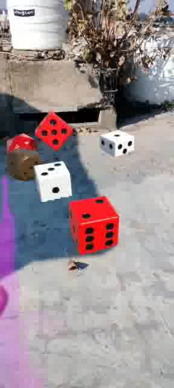

# 💡 Meshing & Occlusion with Lightship ARDK
Meshing is a feature of ARDK that provides 3D geometry of the environment created from images, camera poses and, on high end devices, LIDAR depth frames. That 3D geometry is called the Mesh, generated on the fly up to 10 times a second as the user points their device to previously unseen objects. It can be conceptualized as a thin rubber sheet stretching on the surface of every object, without boundaries between ground, wall, furniture, plants, etc.

The input data needed for meshing is automatically captured when enabling the feature when configuring an IARSession. On the first run, the algorithm requires a neural network model to be downloaded. If the required model version already exists on the device, it will load the cached version into memory

## 💡 Mesh Geometry
The mesh geometry is made up of vertices and faces. Vertices are 3D points; faces are triangles, which are made of three vertices.

In the meshing API, vertices are made of 6 floating point numbers each:
* 3 for the position of the point (x, y, z);
* 3 for its normal vector (nx, ny, nz). The normal vector describes the direction the point is facing, which is used for light rendering and collision physics.

The mesh geometry is expressed in the ARDK’s coordinate system convention, which is right-handed and aligned with gravity along the Y-axis. A transformation is needed to comply with Unity’s right-handed coordinate system convention, by flipping the sign of the Y-axis. Helpers like the ARMesh prefab and ARMeshManager take care of that transformation, which most of the time only amount to applying a scale of (1, -1, 1) on the transform of the mesh’s GameObject.

A mesh face is made of 3 integers, each corresponding to a vertex with that index in the list of vertices. These vertex indices are always arranged in a counter-clockwise order, so each face has a known exterior side.

## ⚒️ Development Tools
* Unity Engine 2021.3.15f1
* Lightship ARDK 2.3.1
* Visual Studio 2019

## ⚒️ Running Locally
Make sure to use Unity 2020 or higher versions for this project to work properly.
* Download [Unity Hub](https://unity3d.com/get-unity/download "Unity Hub")
* Install Unity version 2020 or higher 
</img>
* Install Android Build Support, OpenJDK, Android SDK & NDK Tools
</img>
* Clone the repository `https://github.com/Priyanshu-CODERX/ardk-occlusion-and-meshing.git`
* Open the project with your Unity Engine
* Switch build platform to Android
* Go to project setting's and change the minimum api level to `Android 7.0 API Level 23`
* Switch to Gradle Version higher than 6.7
* Follow the documentation to update AndroidManifest and Base Gradle Template before building the apk
* Build the apk

## ⚒️ Documentations:
* [ARDK Meshing Fundamentals](https://lightship.dev/docs/ardk/context_awareness/meshing/meshing_overview.html "ARDK Meshing Fundamentals")
*  [Building For Android](https://lightship.dev/docs/ardk/ardk_fundamentals/building_android.html#doxid-building-android)

## 💡 Meshing and Occlusion
